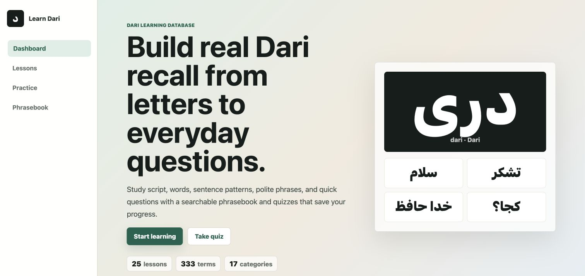
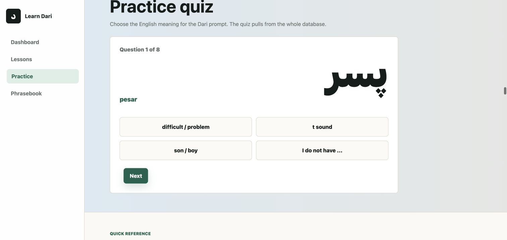
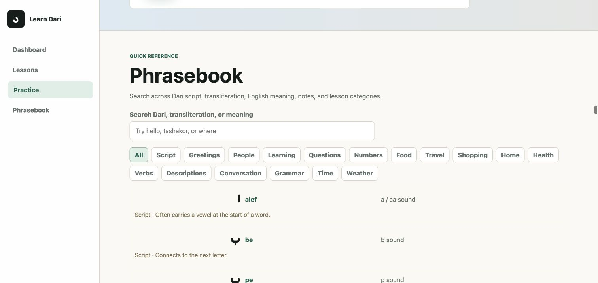

# Learn Zaban

A dependency-free, full-stack web app for learning beginner Dari through structured lessons, a searchable phrasebook, and interactive quizzes.

## Why I built it

Learning a language is easier when vocabulary, useful phrases, and regular practice are all in one focused experience. Learn Zaban provides a simple starting point for Dari learners while demonstrating a practical JavaScript application with both front-end and server-side functionality.

## Features

- 15 lesson groups covering 187 Dari words and phrases
- English meanings, transliteration, and selected usage notes
- Searchable phrasebook with category filtering
- Interactive quiz practice
- Lesson and quiz progress tracking
- Responsive interface for desktop and mobile
- JSON-backed API routes for lessons, quizzes, and progress

## Built with

- Node.js HTTP server
- Vanilla JavaScript, HTML, and CSS
- Netlify Functions
- JSON data storage

## Run locally

    npm install
    npm run dev

Then open http://127.0.0.1:3000.

## Project structure

    public/            Front-end interface
    data/              Lesson content and local progress data
    netlify/functions/ Serverless functions
    server.mjs         Application server and API routes

## Next improvements

- Audio pronunciation for words and phrases
- Spaced-repetition review mode
- Right-to-left writing practice
- User accounts and cloud-synced progress
- Expanded course levels beyond beginner

## Author

Built by [Ariyan Shahrukhi](https://www.linkedin.com/in/shahrukhi/).

## Screenshots

### Dashboard

### Practice quiz

### Searchable phrasebook

